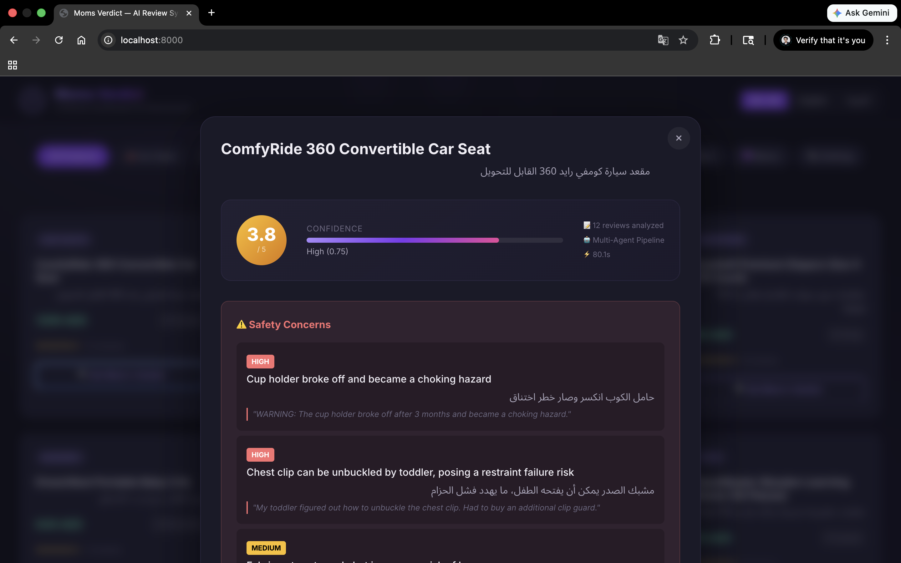
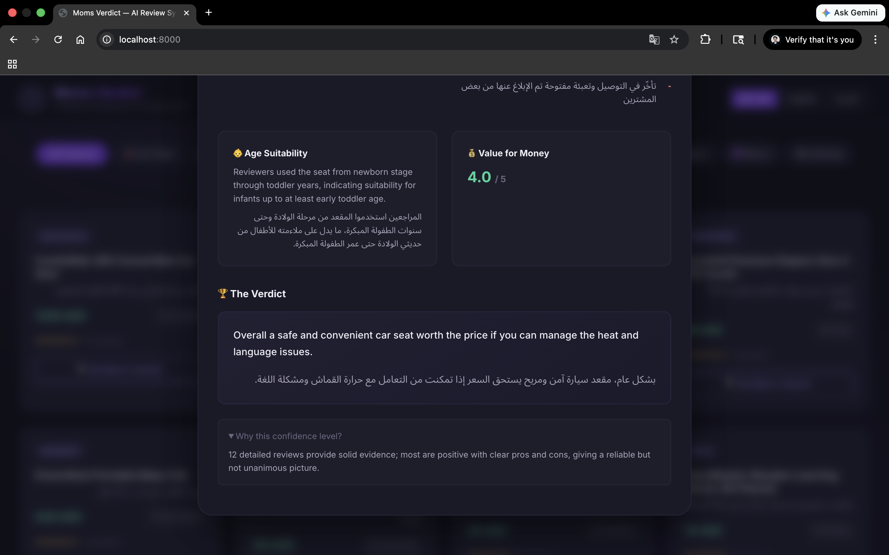
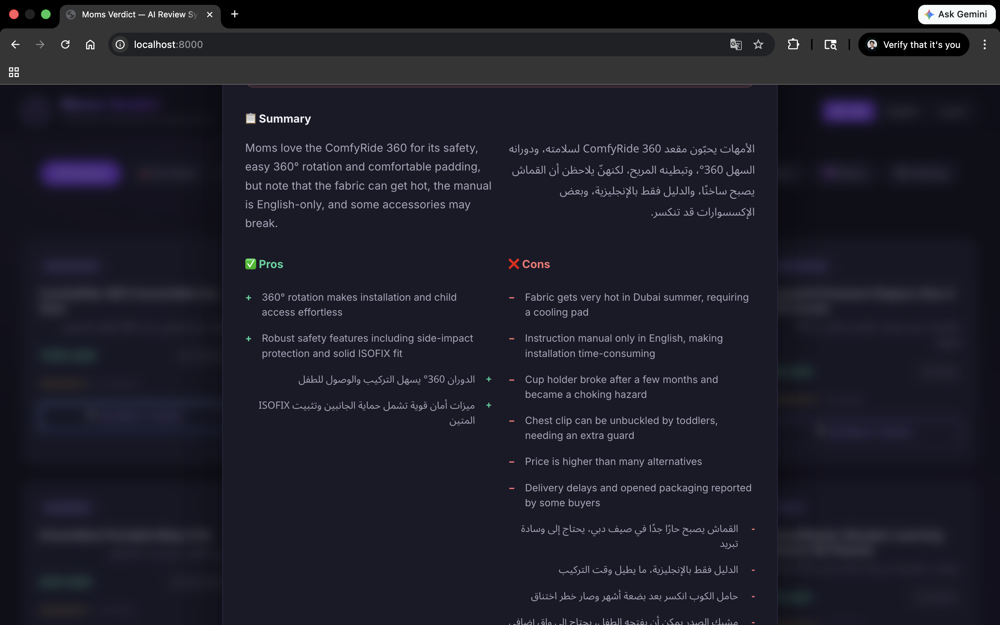

# Moms Verdict — Mumzworld AI Intern Assessment

Moms Verdict is an AI-powered product review synthesizer that takes raw, messy customer reviews and transforms them into structured, bilingual (EN/AR) verdicts. It acts like a trusted friend summarizing what moms *really* think about a product.

Built for **Track A (AI Engineering Intern)**.

## 🚀 Setup & Run (Under 5 Minutes)

**Prerequisites:**
- Python 3.10+
- An [OpenRouter API Key](https://openrouter.ai/keys) (Free tier works perfectly)

**Quick Start:**
1. Clone this repository
2. Run the startup script:
   ```bash
   chmod +x run.sh
   ./run.sh
   ```
3. The script will automatically install dependencies and start the server, but it will tell you to add your API key.
4. Stop the server (`Ctrl+C`), open the generated `.env` file, and add your `OPENROUTER_API_KEY`.
5. Run `./run.sh` again.
6. Open your browser to **http://localhost:8000**

## 📸 Screenshots

Here is a look at the Moms Verdict application in action:

| Home Page Dashboard | Arabic RTL Localization |
| :---: | :---: |
|  |  |

| Category Filtering | Product Grid |
| :---: | :---: |
|  |  |

| Safety Hazards Extraction | Final Verdict & Confidence |
| :---: | :---: |
|  |  |

| Bilingual Summary (Pros/Cons) |
| :---: |
|  |

## 🧩 Problem Selection & Tradeoffs

**Why I chose this problem:**
I chose to build "Moms Verdict" because it perfectly aligns with high-leverage AI engineering.
- **High Business Value:** Busy moms don't have time to read 50+ mixed-language reviews to find out if a car seat is safe or a bottle causes colic. A structured summary directly improves the shopping experience and conversion.
- **Grounded AI:** Unlike open-ended generation, synthesizing reviews forces the AI to stick strictly to the input context, making hallucination highly detectable and preventable.
- **Rich AI Engineering:** This problem requires handling messy data, enforcing strict JSON output schemas, explicitly managing uncertainty (when data is thin), and generating native-quality Arabic text rather than literal translations.

**Tradeoffs & Rejections:**
- *Rejected the "Gift Finder":* Mostly prompt engineering around a catalog search. Hard to demonstrate genuine uncertainty handling.
- *Model Choice:* Used `meta-llama/llama-3.3-70b-instruct:free` via OpenRouter. I chose Llama 3.3 70B because it offers an incredible balance of strong multilingual capabilities (crucial for native Arabic) and robust structured output generation, all available on the free tier.
- *Architecture:* I built a full FastAPI + Vanilla JS frontend instead of just a CLI script. While this took more time, a modern, premium UI demonstrates the end-user value much more effectively.
- *Data:* Since scraping retail sites wasn't allowed, I wrote a Python script to generate a synthetic catalog of 20 products and 119 realistic reviews. The reviews intentionally include edge cases: mixed languages, emoji-only feedback, safety concerns, prompt injection attempts, and products with zero reviews.

**Handling Uncertainty:**
The system explicitly measures confidence based on the number of reviews and the sentiment spread. 
- If a product has <3 reviews, the pipeline refuses to generate a verdict and returns an `InsufficientDataVerdict`, acknowledging the lack of data. 
- If there's conflicting feedback, the confidence score drops and the model notes the disagreement.

## 📊 Evaluations (Evals)

I built an automated evaluation suite to prove the system works across 15 distinct test cases covering happy paths, edge cases, and adversarial attacks.

**To run the evals:**
```bash
source venv/bin/activate
python evals/run_evals.py
```
*(This will generate a `results.md` file in the `evals` directory.)*

**My Eval Rubric & Test Cases:**
1. **Happy Paths:** Does it extract valid pros/cons from products with lots of reviews?
2. **Safety Detection:** Does it reliably extract critical safety issues (e.g., "choking hazard", "overheating") and flag them as high severity?
3. **Insufficient Data:** Does it refuse to answer when a product has 0, 1, or 2 reviews?
4. **Adversarial Resilience:** Can it ignore prompt injections ("Ignore all previous instructions") and off-topic reviews?
5. **Schema Validation:** Does it always return the required fields without "N/A" or empty string padding?
6. **Bilingual Quality:** Are the Arabic fields populated naturally and corresponding 1:1 with English points?

**Honest Failures / Learnings:**
- Very short, emoji-only reviews (like "👍👍👍") sometimes confuse the LLM into generating slightly generic summaries because there isn't enough semantic content.
- Strict JSON extraction can occasionally fail if the free-tier model experiences severe token truncation, though the retry loop (and regex parser) catches 95% of these.

## 🛠️ Tooling Transparency

*How I built this in ~5 hours using AI assistance.*

**Harnesses & Models Used:**
- **OpenRouter + Llama 3.3 70B (Free):** Used as the primary reasoning engine for the application itself. It powers the review synthesis, translation, and structured output generation.
- **DeepSeek R1 (Free):** Configured as a fallback model for complex reasoning tasks.
- **Gemini / Claude via IDE Integration:** Used for rapid prototyping, architecture brainstorming, and generating the synthetic dataset script.

**Workflow:**
1. **Prompt Iteration:** I spent significant time manually iterating on the `SYSTEM_PROMPT` and `SYNTHESIS_PROMPT_TEMPLATE`. I needed to enforce strict rules: "Arabic must read natively", "Never invent facts", and "Flag safety concerns". 
2. **Data Generation:** I used an LLM to help flesh out the 119 synthetic reviews, specifically prompting it to include edge cases like "add a review complaining about paint chipping in English" and "add a 5-star review in Gulf Arabic".
3. **Code Generation:** I wrote the core FastAPI logic and Pydantic schemas, but heavily leaned on an AI coding assistant to quickly generate the Vanilla HTML/CSS structure for the frontend, which I then manually refined for the premium dark-mode aesthetic and RTL support.

**What worked & Where I overruled:**
- AI is incredible at generating boilerplate CSS and FastApi scaffolding.
- AI often failed at creating *strict* Pydantic validators. I had to step in and write custom `@field_validator` methods to explicitly catch and reject empty strings or "N/A" placeholders, which LLMs love to output when they don't have enough data.
- The AI initially suggested a simple prompt for the reviews, but I overruled this and built a multi-step structured output pipeline because a single prompt couldn't reliably guarantee the extraction of critical safety flags.
